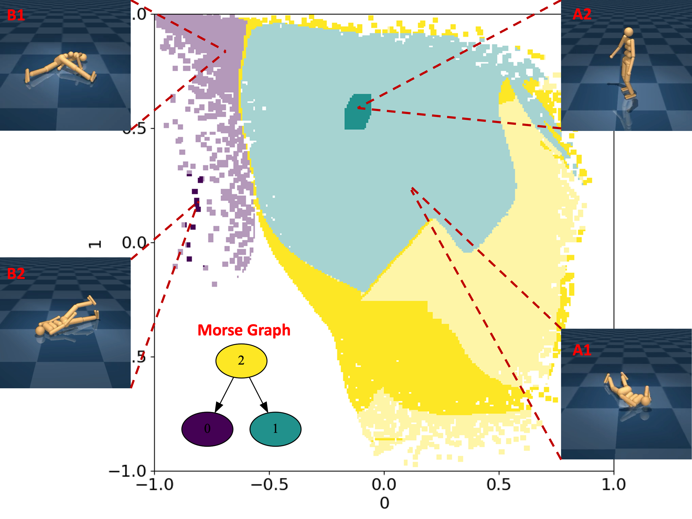

# MORALS:  *Mo*rse Graph-aided discovery of *R*egions of *A*ttraction in a learned *L*atent *S*pace 

Ewerton R. Vieira*, Aravind Sivaramakrishnan*, Sumanth Tangirala, Edgar Granados, Konstantin Mischaikow, Kostas E. Bekris

_2024 IEEE International Conference on Robotics and Automation (ICRA), 2024_. **Best Paper Award in Automation finalist**.

## Introduction
_MORALS_ combines autoencoding neural networks with Morse Graphs. It first projects the dynamics of the controlled system into a learned latent space. Then, it constructs a reduced form of Morse Graphs representing the bistability of the underlying dynamics, i.e., detecting when the controller results in a desired versus an undesired behavior.



## Installation
```
pip install MORALS
```

## Usage

### Reproduce experiments from the paper
1. Download the [Pendulum (LQR) dataset](https://drive.google.com/file/d/1C2SgOQiMpAkpjD-_WJykARZnUYduaL02/view?usp=sharing) or [Other Robot Controllers](https://archive.cs.rutgers.edu/archive/a/2024/MORALS/).
2. Extract and place it inside `examples/data/`. There should be a directory `pendulum_lqr1k` and a labels file `pendulum_lqr1k_success.txt`.
3. Train the autoencoder and latent dynamics networks: `python train.py --config pendulum_lqr.txt`.
4. Obtain the Morse Graph and the Regions of Attraction (RoAs) for the learned latent space dynamics: `python get_MG_RoA.py --config pendulum_lqr.txt --name_out pendulum_lqr --RoA --sub 16`.

### Try out MORALS on your own dataset (WIP)
1. Add a Python class corresponding to your system to `MORALS/systems/`. At the very least, you must provide a name for your system so that its corresponding object can be returned by `MORALS.systems.utils.get_system()`.
2. Generate a config file for your system and place it inside `examples/config/`. You can follow the format of the example config files provided.
3. Follow the steps above to train the autoencoder and latent dynamics networks using your custom config file, and then obtain the Morse Graph and the RoAs.

## Bibtex
If you find this repository useful in your work, please consider citing:
```
@inproceedings{morals2024,
    title={{\tt MORALS}: Analysis of High-Dimensional Robot Controllers via Topological Tools in a Latent Space}, 
    author={Ewerton R. Vieira* and Aravind Sivaramakrishnan* and Sumanth Tangirala and Edgar Granados and Konstantin Mischaikow and Kostas E. Bekris},
    booktitle={ICRA},
    year={2024},
}
```
